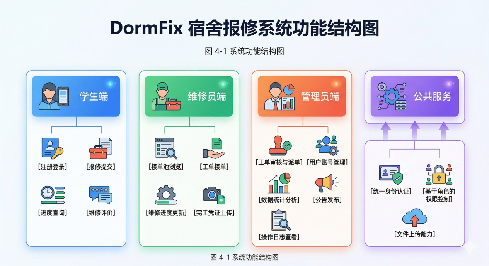
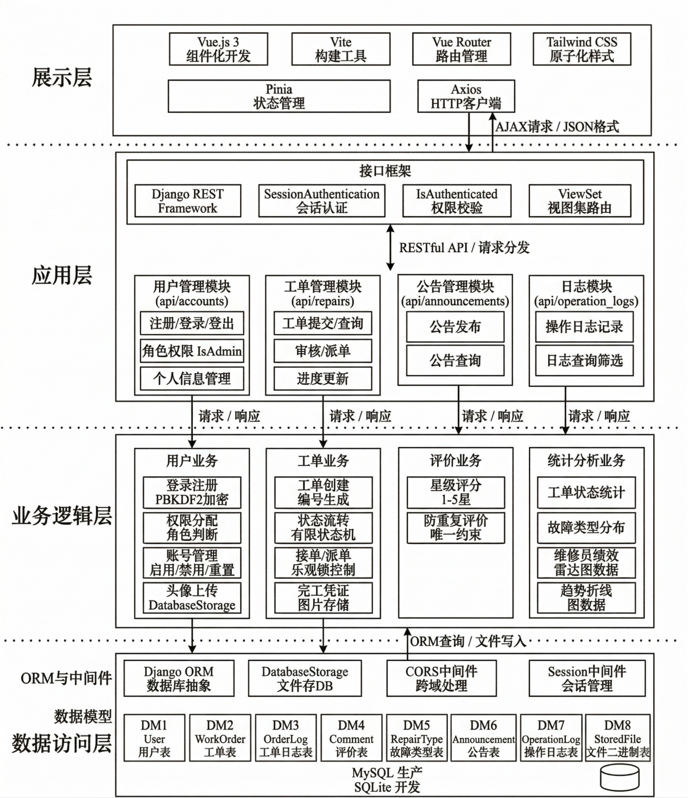
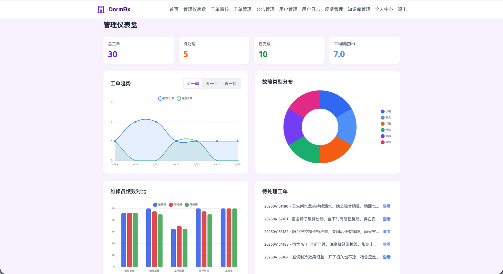
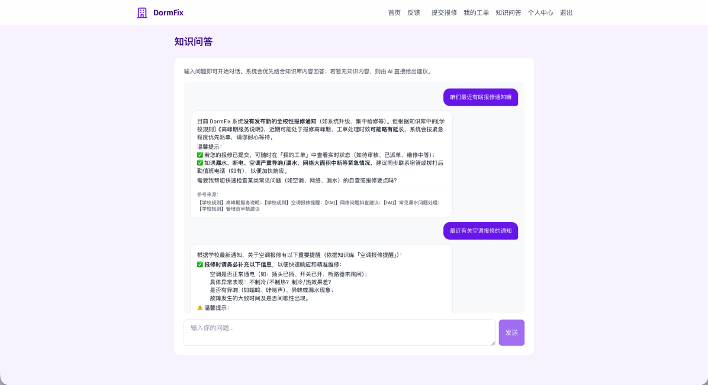
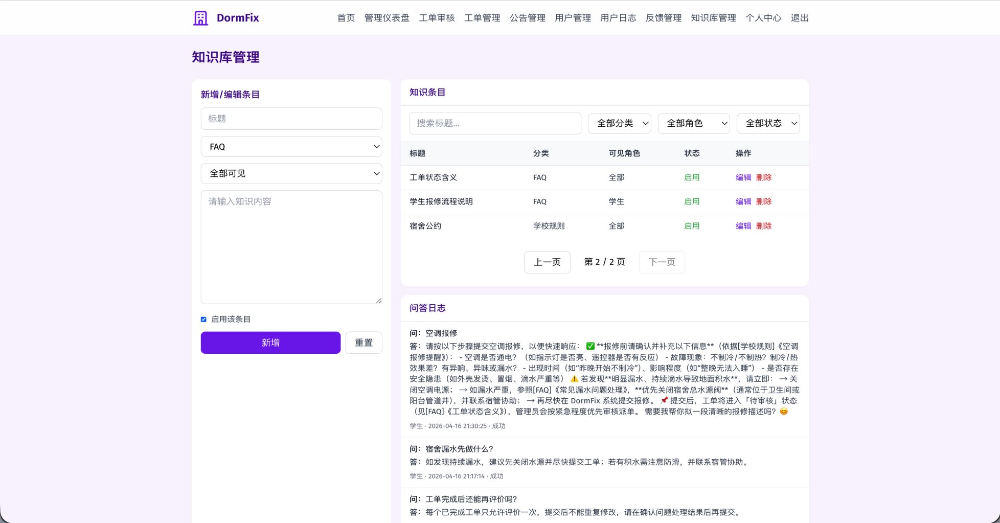

<div align="center">

# DormFix

**宿舍报修工单管理系统**

[](https://www.python.org/)
[](https://www.djangoproject.com/)
[](https://www.django-rest-framework.org/)
[](https://vuejs.org/)
[](https://vitejs.dev/)
[](https://tailwindcss.com/)
[](LICENSE)
[](https://github.com/Jenrimark/DormFix/stargazers)
[](https://deepwiki.com/Jenrimark/DormFix)

<br/>

基于 **Django REST Framework + Vue 3** 的前后端分离宿舍报修平台

支持学生提交报修 · 维修员接单处理 · 管理员审核派单 · AI 知识问答

[English](#english) · [快速启动](#快速启动) · [功能特性](#核心功能) · [API 文档](#api-接口概览)

</div>

---

## 项目简介

<div align="center">

<br/>
<em>DormFix 首页 — 让宿舍报修更简单、更高效</em>
</div>

<br/>

DormFix 针对高校宿舍报修流程中**信息不透明、流转不规范、进度难追踪**等痛点而设计。系统将报修全流程数字化，通过严格的工单状态机约束业务流转，三类角色各司其职，操作全程留有日志可追溯。

### 设计亮点

- **无文件系统依赖** — 图片以二进制存入数据库，部署到任意平台无需配置文件存储
- **数据库自动切换** — `.env` 中 `DB_PASSWORD` 为空即用 SQLite，非空自动切 MySQL
- **全程操作审计** — 用户管理、工单流转均写入操作日志，支持多维度筛选
- **状态机保护** — 工单状态单向流转，后端严格校验每步前置状态，防止越权
- **角色权限隔离** — 学生只看自己的工单，维修员只操作分配的工单，管理员专属接口均有权限校验

---

## 技术架构

<div align="center">

<br/>
<em>系统功能结构图 — 四类角色与核心功能模块</em>
</div>

<br/>

<div align="center">

<br/>
<em>技术架构图 — 前后端分离分层设计</em>
</div>

<br/>

### 技术栈

<table>
<tr>
<td><strong>后端</strong></td>
<td>

| 技术 | 版本 | 用途 |
|------|------|------|
| Python | 3.8+ | 运行环境 |
| Django | 4.2 | Web 框架 |
| Django REST Framework | 3.14 | RESTful API |
| django-cors-headers | 4.3 | 跨域处理 |
| django-simpleui | 2026.1 | Admin 美化 |
| PyJWT | 2.8 | Token 处理 |
| Pillow | 10.2 | 图片处理 |
| MySQL / SQLite | — | 数据持久化（自动切换） |

</td>
</tr>
<tr>
<td><strong>前端</strong></td>
<td>

| 技术 | 版本 | 用途 |
|------|------|------|
| Vue 3 | ^3.4 | 响应式 UI（Composition API） |
| Vite | ^5.0 | 构建工具，极速热更新 |
| Vue Router | ^4.2 | 前端路由，角色守卫 |
| Pinia | ^2.1 | 全局状态管理 |
| Tailwind CSS | ^3.4 | 原子化样式 |
| Axios | ^1.6 | HTTP 请求封装 |
| Chart.js + vue-chartjs | ^4.5 | 数据可视化 |
| @vueuse/core | ^14.2 | 组合式工具函数 |
| marked | ^15.0 | AI 回答 Markdown 渲染 |

</td>
</tr>
<tr>
<td><strong>测试</strong></td>
<td>

| 技术 | 用途 |
|------|------|
| Vitest | 前端单元测试 |
| fast-check | 前端属性测试 |
| hypothesis | 后端属性测试 |

</td>
</tr>
</table>

**认证方案**：Django Session 认证，登录后服务端生成 Session ID 通过 Cookie 返回，会话数据存于服务端，客户端无法篡改。

**文件存储**：自定义 `DatabaseStorage` 后端，图片以二进制写入 `StoredFile` 表，无需额外文件服务器。

---

## 核心功能

<div align="center">

<br/>
<em>通知中心 — 系统公告与重要提醒</em>
</div>

<br/>

### 工单状态机

工单生命周期由有限状态机严格管控，单向流转，防止数据不一致：

```
学生提交 → [待审核 status=0]
              ↓ 管理员审核通过        ↓ 管理员拒绝 / 学生取消
         [已派单 status=1]         [已取消 status=4]
              ↓ 维修员接单 + 开始维修
         [维修中 status=2]
              ↓ 维修员完成 + 上传凭证
         [已完成 status=3]
```

### 三类角色

<details>
<summary><strong>学生端</strong></summary>

- 注册登录（用户名/邮箱，角色默认为学生）
- 提交报修工单（选择故障类型、填写描述、上传现场图片）
- 实时查看工单进度（状态、维修员信息、时间线）
- 工单完成后提交 1-5 星评价与文字反馈
- 在待审核/已派单阶段可主动取消工单
- AI 知识问答（聊天式界面，支持流式输出）
- 提交系统反馈、查看处理进度与管理员回复

</details>

<details>
<summary><strong>维修员端</strong></summary>

- 查看接单池（所有 status=1 且未被接取的工单）
- 主动接单，系统记录接单时间
- 开始维修 / 完成维修，上传维修凭证图片
- AI 知识问答（结合管理员录入的 FAQ / SOP / 规则）

</details>

<details>
<summary><strong>管理员端</strong></summary>

- 工单审核（通过/拒绝，拒绝必须填写原因）
- 手动派单（指定维修员）
- 用户管理（创建/编辑/删除/启用/禁用/重置密码/批量操作）
- 数据仪表盘（工单统计、故障类型分布、趋势折线图、维修员绩效雷达图）
- 系统公告发布与管理
- 反馈管理（处理反馈、回复用户、更新状态）
- 操作日志查看（按操作人、操作类型、时间范围筛选）
- 知识库管理（FAQ / SOP / 规则，按角色控制可见范围）

</details>

<div align="center">

<br/>
<em>管理仪表盘 — 工单统计、故障分布、绩效分析</em>
</div>

<br/>

<div align="center">

<br/>
<em>工单详情 — 完整的维修记录与用户评价</em>
</div>

### 评价系统

- 学生可对已完成工单提交 1-5 星评价与文字反馈
- 每个工单仅允许评价一次，防止重复提交
- 评价结果用于维修质量追踪与管理员绩效分析

### 反馈系统

- 用户可提交系统反馈（功能建议 / 使用问题 / 投诉 / 其他）
- 管理员在后台统一处理反馈（状态流转 + 回复）
- 管理员回复后自动触发站内通知与红点提示

### AI 知识问答

- 学生与维修员可通过聊天式界面提问（支持流式输出）
- 回答优先结合管理员维护的文字知识库（FAQ / SOP / 规则）
- 知识库覆盖不足时，AI 给出通用建议并提示以规则为准
- 管理员可维护知识条目并查看问答日志

<div align="center">

<br/>
<em>知识问答 — AI 智能问答，结合知识库精准回答</em>
</div>

<br/>

<div align="center">

<br/>
<em>知识库管理 — FAQ / SOP / 规则维护界面</em>
</div>

---

## 快速启动

### 环境要求

| 依赖 | 版本 |
|------|------|
| Python | 3.8+ |
| Node.js | 18+ |
| npm | 9+ |

### 1. 克隆项目

```bash
git clone https://github.com/Jenrimark/DormFix.git
cd DormFix
```

### 2. 后端启动

```bash
# 创建虚拟环境
python3 -m venv venv
source venv/bin/activate   # Windows: venv\Scripts\activate

# 安装依赖
pip install -r requirements.txt

# 配置环境变量
cp .env.example .env       # 编辑 .env，至少填写 LLM_API_KEY

# 数据库迁移
python manage.py migrate

# （可选）生成演示数据
python manage.py seed_demo_data

# 启动后端
python manage.py runserver  # http://localhost:8000
```

或使用启动脚本：

```bash
./start_backend.sh
```

### 3. 前端启动

```bash
cd frontend-vue
npm install
npm run dev                # http://localhost:5173
```

### 4. 前端构建

```bash
cd frontend-vue
npm run build              # 输出到 frontend-vue/dist/
```

### 环境变量

项目所有配置统一从根目录 `.env` 读取。复制模板后按需修改：

```bash
cp .env.example .env
```

| 变量 | 必填 | 说明 |
|------|------|------|
| `DJANGO_SECRET_KEY` | 否 | Django 密钥，生产环境务必修改 |
| `DJANGO_DEBUG` | 否 | 调试模式，生产环境设为 `False` |
| `DJANGO_ALLOWED_HOSTS` | 否 | 允许访问的域名，逗号分隔 |
| `DB_PASSWORD` | 否 | 为空使用 SQLite，非空切换 MySQL |
| `DB_NAME` | 否 | 数据库名称（默认 `DormFix`） |
| `DB_USER` | 否 | 数据库用户名（默认 `root`） |
| `DB_HOST` | 否 | 数据库主机（默认 `localhost`） |
| `DB_PORT` | 否 | 数据库端口（默认 `3306`） |
| `LLM_API_KEY` | **是** | 大模型 API Key（知识问答功能必需） |
| `LLM_BASE_URL` | 否 | OpenAI 兼容接口地址 |
| `LLM_MODEL` | 否 | 模型名称（默认 `qwen-plus`） |
| `LLM_TIMEOUT_SECONDS` | 否 | 请求超时秒数（默认 `30`） |

### 数据库初始化

```bash
# SQLite（默认）
./scripts/init_db.sh

# MySQL
mysql -u root -p < scripts/create_mysql_db.sql
# 然后在 .env 中设置 DB_PASSWORD
```

### 访问地址

| 服务 | 地址 |
|------|------|
| Vue 前端 | http://localhost:5173 |
| 后端 API | http://localhost:8000/api/ |
| Django Admin | http://localhost:8000/admin/ |

### 内置账号

执行 `python manage.py seed_demo_data` 后可使用以下演示账号：

| 角色 | 用户名 | 密码 |
|------|--------|------|
| 管理员 | `admin` | `admin123` |
| 维修员 | `repairman1` / `repairman2` / `repairman3` | `repair123` |
| 学生 | `student1` ~ `student5` | `student123` |

演示数据包含 30 条工单、5 条评价、15 条反馈、10 条通知、12 条知识条目、4 条公告、8 条问答日志。重复执行会清理旧数据后重新生成。

---

## 项目结构

```
DormFix/
├── dormfix_backend/        # Django 项目配置
│   ├── settings.py         # 数据库自动切换、Session、CORS、日志
│   └── urls.py
├── accounts/               # 用户认证与管理
│   ├── models.py           # User、OperationLog
│   ├── views.py            # 注册、登录、用户 CRUD、批量操作
│   └── management/commands/
│       └── seed_demo_data.py
├── repairs/                # 工单业务模块
│   ├── models.py           # WorkOrder、RepairType、OrderLog、StoredFile
│   ├── views.py            # 工单 CRUD、审核、派单、接单、完工、统计
│   ├── storage_db.py       # 自定义数据库文件存储后端
│   └── permissions.py      # IsStudent、IsRepairman、IsAdmin、IsOwnerOrAdmin
├── announcements/          # 系统公告模块
├── feedbacks/              # 系统反馈模块
├── notifications/          # 站内通知模块
├── knowledge_base/         # AI 知识问答与知识库管理
│   └── services/
│       ├── llm_service.py  # OpenAI 兼容 LLM 客户端（流式 + 非流式）
│       └── document_parser.py
├── frontend-vue/           # Vue 3 前端
│   ├── src/
│   │   ├── api/            # Axios 请求封装
│   │   ├── router/         # 路由配置与角色守卫
│   │   ├── stores/         # Pinia 状态管理
│   │   ├── views/          # 21 个页面组件
│   │   ├── components/     # 14 个通用组件
│   │   └── composables/    # 组合式函数
│   ├── vite.config.js
│   └── tailwind.config.js
├── scripts/                # 工具脚本
│   ├── create_mysql_db.sql
│   ├── init_db.sh
│   └── auto-git-check.sh
├── .env.example            # 环境变量模板
├── requirements.txt        # Python 依赖
├── manage.py               # Django 入口
└── start_backend.sh        # 后端启动脚本
```

---

## API 接口概览

### 认证

| 方法 | 端点 | 说明 |
|------|------|------|
| `POST` | `/api/accounts/users/register/` | 用户注册 |
| `POST` | `/api/accounts/users/login/` | 用户登录 |
| `POST` | `/api/accounts/users/logout/` | 用户登出 |

### 工单

| 方法 | 端点 | 说明 |
|------|------|------|
| `POST` | `/api/repairs/work-orders/` | 提交报修工单 |
| `GET` | `/api/repairs/work-orders/my_orders/` | 查看我的工单 |
| `POST` | `/api/repairs/work-orders/{id}/review/` | 管理员审核工单 |
| `POST` | `/api/repairs/work-orders/{id}/assign/` | 管理员派单 |
| `POST` | `/api/repairs/work-orders/{id}/accept/` | 维修员接单 |
| `POST` | `/api/repairs/work-orders/{id}/start_repair/` | 维修员开始维修 |
| `POST` | `/api/repairs/work-orders/{id}/complete_repair/` | 维修员完成维修 |

### 反馈 & 知识问答

| 方法 | 端点 | 说明 |
|------|------|------|
| `POST` | `/api/feedbacks/` | 提交系统反馈 |
| `GET` | `/api/feedbacks/my/` | 查看我的反馈 |
| `POST` | `/api/knowledge/ask/` | 非流式问答 |
| `POST` | `/api/knowledge/ask_stream/` | 流式问答（SSE） |
| `GET/POST/PUT/DELETE` | `/api/knowledge/` | 管理员维护知识条目 |
| `GET` | `/api/announcements/latest/` | 最新公告 |

---

## 数据库设计

| 表名 | 说明 |
|------|------|
| `users` | 用户表，含 role（1学生/2维修员/3管理员）、is_active、dorm_code |
| `work_orders` | 工单表，含 status、repair_type、repairman、review_remark |
| `order_logs` | 工单操作日志，记录每次状态变更的操作人与备注 |
| `stored_files` | 图片二进制存储表，存 filename、mime_type、content |
| `operation_logs` | 系统操作审计日志，记录用户管理等关键操作 |
| `knowledge_items` | 知识条目表（FAQ / SOP / 规则，支持按角色可见） |
| `qa_logs` | 知识问答日志（问题、回答、成功状态、错误信息） |

---

## 测试

```bash
# 前端测试
cd frontend-vue
npm run test               # 单次运行
npm run test:watch         # 监听模式

# 后端测试
python manage.py test
```

前端使用 **Vitest + fast-check** 进行属性测试，后端使用 **hypothesis** 进行属性测试。

---

## 部署

### 生产环境检查清单

- [ ] 设置 `DJANGO_DEBUG=False`
- [ ] 生成新的 `DJANGO_SECRET_KEY`
- [ ] 配置 `DJANGO_ALLOWED_HOSTS`
- [ ] 配置 MySQL 数据库（设置 `DB_PASSWORD`）
- [ ] 配置 `LLM_API_KEY`（知识问答功能）
- [ ] 执行 `python manage.py migrate`
- [ ] 执行 `python manage.py collectstatic`
- [ ] 使用 Gunicorn / uWSGI 部署后端
- [ ] 使用 Nginx 反向代理并托管前端静态文件

---

<a id="english"></a>

## English

**DormFix** is a dormitory repair work order management system built with Django REST Framework and Vue 3. It digitizes the entire repair workflow for university dormitories — from student submission through admin review, repairman assignment, repair completion, and post-repair rating.

### Key Features

- **Work Order Lifecycle** — strict finite state machine: Submitted → Assigned → In Progress → Completed/Cancelled
- **Three Roles** — Students submit & track orders; Repairmen accept & complete repairs; Admins review, assign & manage
- **AI Knowledge Q&A** — chat-style interface with streaming output, backed by admin-maintained knowledge base
- **Data Dashboard** — order statistics, fault type distribution, trend charts, repairman performance radar
- **Operation Audit Logs** — all critical operations logged with operator, action type, timestamp, and IP
- **Zero File System Dependency** — images stored as binary in database, deployable anywhere

### Quick Start

```bash
git clone https://github.com/Jenrimark/DormFix.git
cd DormFix

# Backend
python3 -m venv venv && source venv/bin/activate
pip install -r requirements.txt
cp .env.example .env        # Edit .env, set LLM_API_KEY
python manage.py migrate
python manage.py seed_demo_data  # Optional: generate demo data
python manage.py runserver

# Frontend (new terminal)
cd frontend-vue
npm install && npm run dev
```

| Service | URL |
|---------|-----|
| Frontend | http://localhost:5173 |
| Backend API | http://localhost:8000/api/ |
| Django Admin | http://localhost:8000/admin/ |

### Demo Accounts

| Role | Username | Password |
|------|----------|----------|
| Admin | `admin` | `admin123` |
| Repairman | `repairman1` / `repairman2` / `repairman3` | `repair123` |
| Student | `student1` ~ `student5` | `student123` |

---

## 贡献

欢迎提交 Issue 和 Pull Request。请在提交前确保：

1. Fork 本仓库并创建特性分支
2. 代码通过现有测试 (`npm run test` / `python manage.py test`)
3. 提交信息清晰描述变更内容

## 许可证

本项目基于 [Apache License 2.0](LICENSE) 开源。

---

<div align="center">

**DormFix** © 2026 · Jenrimark

如果这个项目对你有帮助，请给一个 Star 支持一下

</div>
